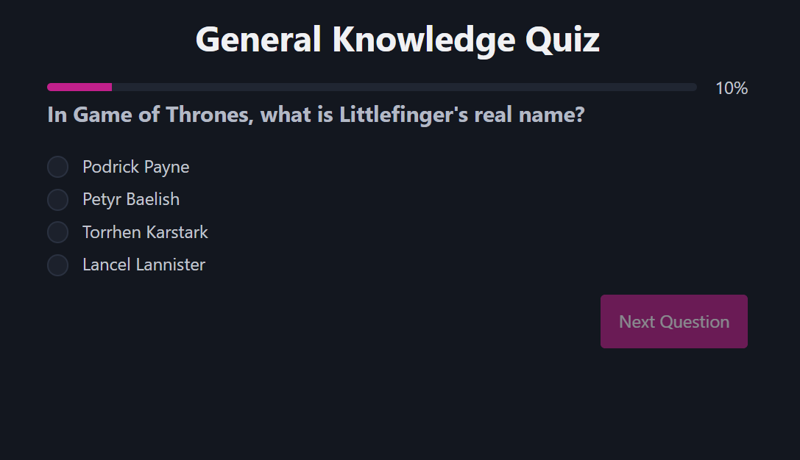
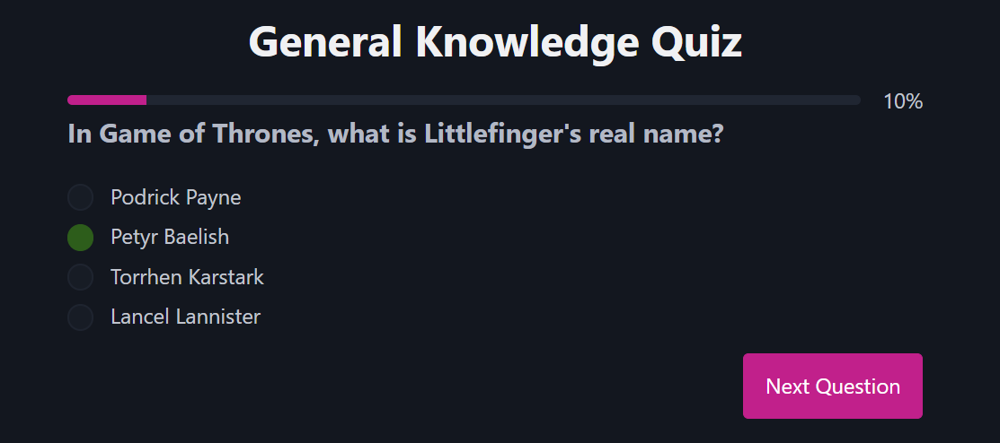
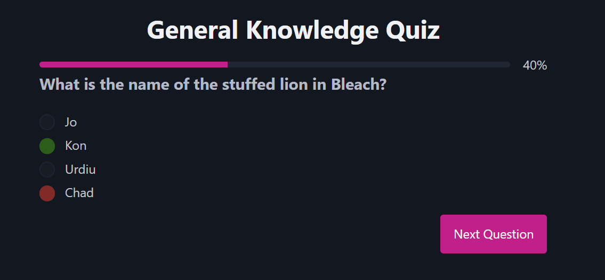
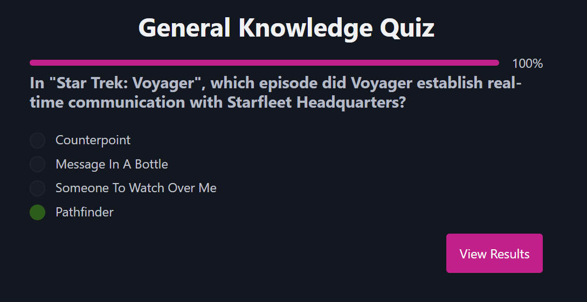
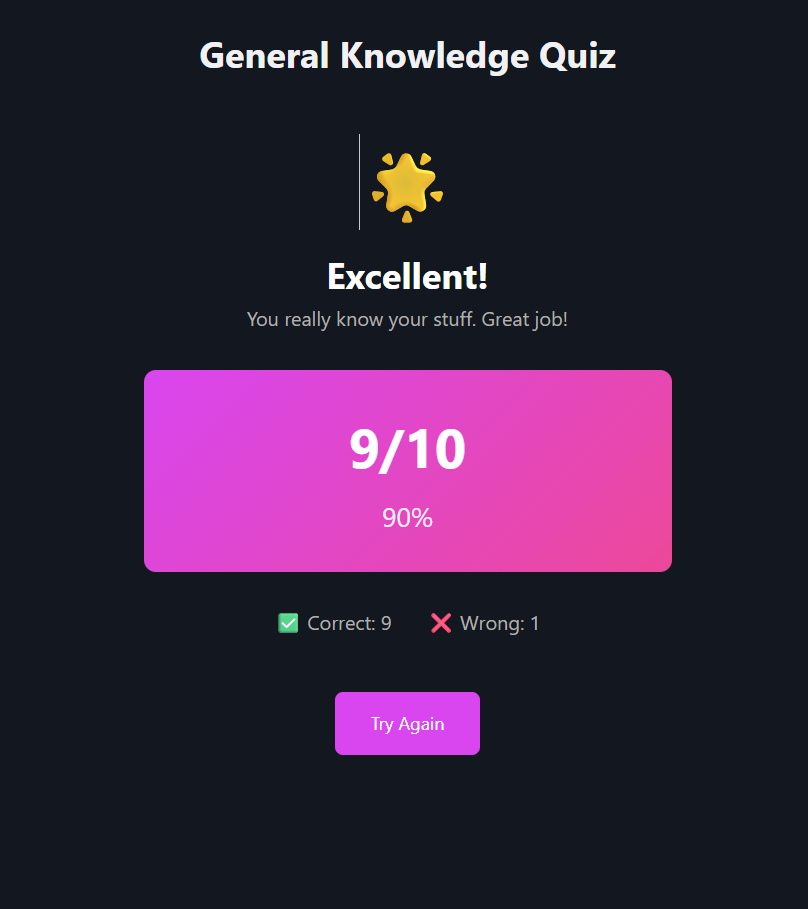

# 🧠 Vue Quiz App

A modern, interactive quiz application built with **Vue 3**, **TypeScript**, and **Vite**. This project demonstrates core Vue.js concepts through a fully functional quiz experience.

🔗 **[Try it live →](https://vue-quiz-app-pearl.vercel.app/)** Test the quiz online right now!











---

## ✨ Features

### Quiz Functionality
- 📝 **Dynamic Question Loading** - Fetches questions from Open Trivia Database API
- 🎯 **Multiple Choice & True/False** - Supports both question types
- 🎨 **Interactive Answers** - Radio buttons with visual feedback (correct/wrong answers highlighted)
- 📊 **Progress Tracking** - Real-time progress bar showing completion percentage
- ⏱️ **Auto-Advance Timer** - Questions automatically advance after 6 seconds (~2 minutes for 10 questions)
- 🏁 **Results Summary** - Detailed recap with score, percentage, and custom motivational messages

### Vue 3 Learning Features
- ✅ **Composition API** - Using `<script setup>` syntax
- 🔄 **Reactive State Management** - `ref()` and `computed()` for component state
- 👀 **Watchers** - Auto-reset state when switching questions
- 🔗 **Custom Events** - Parent-child communication with emit
- 🎭 **Conditional Rendering** - `v-if`, `v-else` for dynamic UI
- 🔁 **List Rendering** - `v-for` for displaying answer options
- 🏗️ **Component Composition** - Modular, reusable components

---

## 🎓 Learning Objectives Achieved

This project teaches essential Vue.js concepts:

| Concept | Implementation |
|---------|-----------------|
| **State Management** | Tracking quiz progress, answers, and results with `ref` |
| **Computed Properties** | Calculating score percentage dynamically |
| **Watchers** | Re-initializing component state when questions change |
| **Event Handling** | Custom events (`@answer`, `@restart`) |
| **API Integration** | Fetching questions from external API with error handling |
| **Type Safety** | Full TypeScript support for type-safe components |
| **Component Structure** | Parent-child relationships and data flow |

---

## 📁 Project Structure
```
src/
├── components/
│   ├── Quiz.vue          # Main quiz container, state management
│   ├── Question.vue      # Single question with answer options
│   ├── Answer.vue        # Answer options with visual feedback
│   ├── Progress.vue      # Progress bar component
│   └── Recap.vue         # Results screen with score display
├── composables/
│   ├── Api.ts            # API integration for fetching questions
│   └── useShuffleArray.ts # Utility for shuffling answer options
├── App.vue               # Root component
└── main.ts               # Entry point
```

---

## 🚀 Getting Started

### 🎯 Live Demo

**No installation needed!** 

[👉 **Test the quiz online right now →**](https://vue-quiz-app-pearl.vercel.app/)

---

### Local Development

#### Prerequisites
- Node.js 18+
- npm or yarn

#### Installation
```bash
# Install dependencies
npm install

# Start development server
npm run dev

# Build for production
npm run build
```

---

## 🎮 How to Use

1. **Start the Quiz** - Click "Start Quiz" to begin
2. **Answer Questions** - Select an answer from the radio options
3. **Visual Feedback** - Correct answers show green, wrong answers show red
4. **Auto-Advance** - Questions automatically advance after 6 seconds
5. **Progress** - Watch the progress bar fill as you advance
6. **View Results** - See your final score with a motivational message
7. **Try Again** - Click "Try Again" to restart and retake the quiz

**⏱️ Quiz Duration:** ~2 minutes for 10 questions (6 seconds per question auto-advance)

---

## 💡 Key Vue Concepts Demonstrated

### Reactive State
```typescript
const step = ref(0);              // Current question index
const answers = ref([]);          // User's answers
const score = computed(() => {}) // Calculated score
```

### Custom Events with Typing
```typescript
// Child emits answer with type safety
const emits = defineEmits<{
  answer: [answer: string | null]
}>();

// Parent listens
@answer="addAnswer"
```

### Component Keys for Re-rendering
```vue
<!-- Force re-render when question changes -->
<Question :key="step" :question="currentQuestion" />
```

### v-model in Child Components
```typescript
// Child component
const model = defineModel<string | null>();

// Parent usage
<Answer v-model="selectedAnswer" />
```

### API Integration
```typescript
const { questions, loading, error } = useFetchQuestions();
await fetchQuestions('https://opentdb.com/api.php?amount=10');
```

---

## 🎨 UI Highlights

- **Modern Dark Theme** - Easy on the eyes with pink/magenta accent colors
- **Responsive Design** - Works seamlessly on desktop and mobile
- **Progress Visualization** - Clear progress bar with percentage
- **Visual Feedback** - Green for correct answers, red for incorrect
- **Dynamic Messaging** - Personalized feedback based on score:
  - 🎉 100% → "Perfect Score!"
  - 🌟 80%+ → "Excellent!"
  - 👍 60%+ → "Good Job!"
  - 💪 40%+ → "Not Bad!"
  - 📚 <40% → "Keep Learning!"

---

## 🛠️ Technologies Used

- **Vue 3** - Progressive JavaScript framework
- **TypeScript** - Type-safe JavaScript
- **Vite** - Lightning-fast build tool
- **Open Trivia Database API** - Free quiz questions
- **CSS3** - Modern styling with gradients and transitions
- **Pico CSS** - Minimal CSS framework for semantic HTML styling

---

## 🌐 Deployment

This project is deployed on **Vercel** with automatic CI/CD integration:
- **Live URL**: [vue-quiz-app-pearl.vercel.app](https://vue-quiz-app-pearl.vercel.app/)
- Every `git push` automatically redeploys the app
- Zero downtime deployments
- Instant preview URLs for pull requests

---

## 📚 Resources

- [Vue 3 Documentation](https://vuejs.org/)
- [TypeScript Handbook](https://www.typescriptlang.org/docs/)
- [Vite Guide](https://vite.dev/)
- [Open Trivia Database](https://opentdb.com/)

---

## 🔧 Recommended IDE Setup

- **VS Code** + **[Volar](https://marketplace.visualstudio.com/items?itemName=Vue.volar)** (disable Vetur)
- **Vue DevTools** browser extension for debugging

---

## 📝 Notes

This project is an educational tool created to master Vue 3 fundamentals. It showcases real-world patterns like component composition, state management, API integration, and proper TypeScript typing.

**Perfect for learning:** Components, Reactivity, Events, Computed Properties, Watchers, and Props Drilling!

---

## 📄 License

Open source - feel free to use and modify for learning purposes.